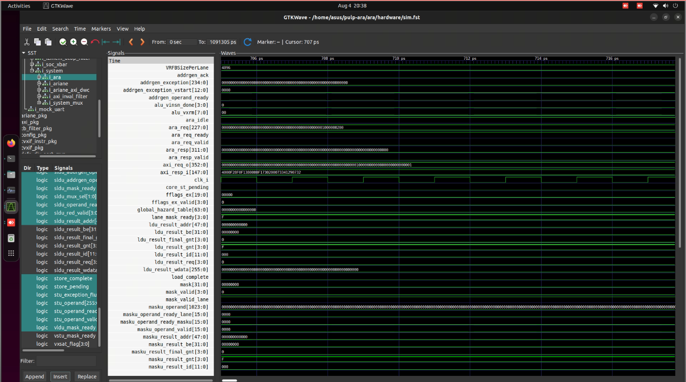
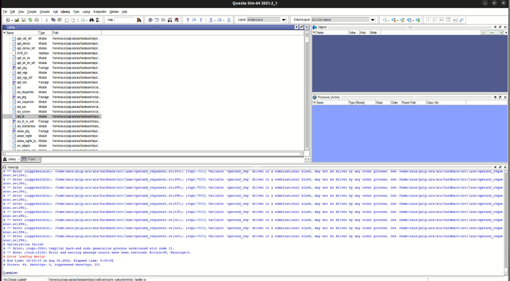

# Building pulp-platform/ara with Makefile workflow

### Environment details
```
Ubuntu 22.04 LTS for AMD64 platform
Linux Kernel Version: 6.8 (HWE)
Required library dependencies installed as listed in Section 1.1
```
**Please Note:** Ubuntu 22LTS is the only known env to have the maximum success and several issues arise with newer 24.04LTS (bender not available, some deps lib versions are different)
## 1 - Prerequisites

The software packages used by `ara` including LLVM-toolchain, RISCV tools require following packages to be installed.

```
sudo apt-get install autoconf automake autotools-dev curl python3 python3-pip libmpc-dev libmpfr-dev libgmp-dev gawk build-essential bison flex texinfo gperf libtool patchutils bc zlib1g-dev libexpat-dev ninja-build git cmake libglib2.0-dev libslirp-dev device-tree-compiler libboost-regex-dev libboost-system-dev
```

## 2- Building ara for RTL simulations using Questa

### 2.1 Download sources
```
# Clone the repository with latest release
git clone https://github.com/pulp-platform/ara.git
cd ara

# download additional requried modules
git submodule update --init --recursive
git submodule sync --recursive

# download additional Hardware dependencies using bender
cd hardware 
make checkout
```
- if `make checkout` doesn't work, use `make update` and then try `make checkout`

The results should look like this:
```
/home/runner/work/ara-build-playground/ara-build-playground/ara/hardware/../hardware/bender checkout
    Checkout common_verification (https://github.com/pulp-platform/common_verification.git)
     Cloning common_verification (https://github.com/pulp-platform/common_verification.git)
    Checkout tech_cells_generic (https://github.com/pulp-platform/tech_cells_generic.git)
     Cloning tech_cells_generic (https://github.com/pulp-platform/tech_cells_generic.git)
    Checkout common_cells (https://github.com/pulp-platform/common_cells.git)
     Cloning common_cells (https://github.com/pulp-platform/common_cells.git)
    Checkout fpu_div_sqrt_mvp (https://github.com/pulp-platform/fpu_div_sqrt_mvp.git)
     Cloning fpu_div_sqrt_mvp (https://github.com/pulp-platform/fpu_div_sqrt_mvp.git)
    Checkout axi (https://github.com/pulp-platform/axi.git)
     Cloning axi (https://github.com/pulp-platform/axi.git)
    Checkout fpnew (https://github.com/pulp-platform/cvfpu.git)
     Cloning fpnew (https://github.com/pulp-platform/cvfpu.git)
    Checkout apb (https://github.com/pulp-platform/apb.git)
     Cloning apb (https://github.com/pulp-platform/apb.git)
    Checkout cva6 (https://github.com/mp-17/cva6.git)
     Cloning cva6 (https://github.com/mp-17/cva6.git)
```


**Note:** llvm-toolchain may not be necessary as far as only RTL sims are concerned but the later steps does not succeed unless the previous steps are successfully finished. So its required.

The results upto this stage can be verified from the [Actions run](https://github.com/aitesam961/ara-build-playground/actions/runs/9795191450/job/27046776347) in this repository

### 2.2 Build LLVM-Toolchain

```
cd ara
make toolchan-llvm
```
**Note:** `make toolchain-llvm` by default configures `make -j(nproc) to -j32 which may destabilize the environment when running in virtual machines. Signs may include VM crashing, freezing or restarting itself. 

To **FIX** this, modify the `ara/Makefile` by replacing -j32 with (number-of-cpu-threads-on-your-vm)-2 to avoid overutilization of context switching.

`ara/Makefile line: 143, 158`

**Note:** The top level test bench requires riscv-tools custom built for ara to generate the binaries that are fed into tb. (At least thats what I understand. Please correct me if I'm wrong).

### 2.3 Build riscv-isa-sim 

riscv-isa-sim is involved in building the riscv-gnu-toolchain customized for pulp-ara. Proceed as follows:

```
cd ara
make riscv-isa-sim
```
Occassionaly, you may get `make: *** No rule to make target`. That appears sometimes when Makefile terminates without completion and as a prevention measure, the scripts somehow mark that task as done to avoid redoing.

To **FIX** this, slightly edit the Makefile (add another line/comment etc) and retry. If still persists, rerun `git submodule update --init --recursive`

### 2.4 Manually Install RISCV-GNU toolchain
Now, makefile scripts for some reason does not reliably build the riscv-gnu toolchain. Perhaps the assumption that most users already have it. 

To build the toolchain compatible with makefile steps, execute the following command in project `ara` home directory.

```
cd /install/riscv-gcc
# Build riscv-binutils
cd toolchain/riscv-gnu-toolchain
rm -rf build && mkdir -p build && cd build
CC=$(CC) CXX=$(CXX) ../configure --prefix="$GCC_INSTALL_DIR" --with-arch=rv64gcv --with-cmodel=medlow --enable-multilib
make -j8
```

This script should build the riscv-gcc toolchain. If fails, please fetch a pre-built toolchain from my previous attempt (https://github.com/aitesam961/soft-sky-riscv-gnu-prebuilt) and add to path using the instructions available. Ensure the riscv-toolchain path aligns with ara required binary path.


### 2.5 Install/setup  Questasim
Install Questasim using the standard installation procedure and add to path. The versions supported by Pulp-ara are `2019.3` & `2021.2`. Later is being used in this case.

**Check My Guide for installing Questasim**: https://gist.github.com/aitesam961/608ec27862e942e5ae1360fd0ba2b4d2

Now, even when Questasim installed and added to path, visible to the Makefile, still you may encounter this error.

```
Makefile:83: "Specified QuestaSim version (questa-2021.2) not found in PATH /opt/questasim/linux_x86_64:/usr/local/sbin:/usr/local/bin:/usr/sbin:/usr/bin:/sbin:/bin:/usr/games:/usr/local/games:/snap/bin"
```

This refers to the following lines in ara/hardware/Makefile

```
ifeq (, $(shell which $(questa_cmd)))
  # Spaces are needed for indentation here!
  $(warning "Specified QuestaSim version ($(questa_cmd)) not found in PATH $(PATH)")
  questa_cmd =
endif
```

Even if you have Questasim successfully installed and in Path, still this warning would appear. Even the Makefile is able to launch questa during simulation attempt but still not able to find.
So, no work around, let's live with it.


### 2.6 Install Verilator
Although we plan no to use verilator but below is the process to work around the issues and intsall the required version for ara.

`make verilator` likely returns error
```
configure: error: in `/home/asus/pulp-ara/ara/toolchain/verilator':
configure: error: C compiler cannot create executables
See `config.log' for more details
make: *** [Makefile:168: /home/ara/install/verilator] Error 77
```

This is caused by the Compiler Flags. The quick workaround I could find is: modify the ara/Makefile at line # 169
```
# Replace
CC=$(CLANG_CC) CXX=$(CLANG_CXX) CXXFLAGS=$(CLANG_CXXFLAGS) LDFLAGS=$(CLANG_LDFLAGS)

# With
CC="" 
```
This allows verilator to be built with default compiler (g++ through C++ compiler) instead of CLANG for LLVM.

While sometime it works, sometimes you might be greeted by the following errors after build is complete: 
```
make[3]: Leaving directory '/home/asus/pulp-ara/ara/toolchain/verilator/src/obj_opt'
make[2]: Leaving directory '/home/asus/pulp-ara/ara/toolchain/verilator/src'
make[1]: Leaving directory '/home/asus/pulp-ara/ara/toolchain/verilator'
make: *** [Makefile:168: /home/asus/pulp-ara/ara/install/verilator] Error 2
```

I cannot find a potential fix or workaround for it. Anyways, we're not using Verilator so Let's skip it for now.

The other way to do is, in the compiler flags, replace `CLANG_CC` with `clang` and `CLANG_CXX` with `clang++` and it should build verilator just fine.
### 2.7 RTL Simulation using Verilator

Now that we have verilator, simulations doesn't work using the provided scripts though.
Running the simulation using fmatmul binary loaded:

```
# Compile fmatmul for Ara                                                                      
make -C apps bin/fmatmul        
# Verilate the design
make -C hardware verilate trace=1 
# Run fmatmul on Ara through Verilator
make -C hardware simv app=fmatmul trace=1 
```
Returns the following error.
```
bash: line 1: build/verilator/Vara_tb_verilator: No such file or directory
make: *** [Makefile:232: simv] Error 127

```

### FIX 

A fresh clone and build from scratch, verilator installation with patched makefile magically fixes the issue and RTL simulation of `fmatmul` binary successfully returns the results.

**Simulation Script**

```
# Compile fmatmul for Ara                                                                      
make -C apps bin/fmatmul        
# Verilate the design
make -C hardware verilate trace=1 -B 
# Run fmatmul on Ara through Verilator
make -C hardware simv app=fmatmul trace=1 
```

**Results**
```
Set `ram TOP.ara_tb_verilator.dut.i_ara_soc.i_dram 10 0x80000000 0x100000 write with offset: 0x0 write with size: 0x81ff8
Simulation of Ara
=================

Tracing can be toggled by sending SIGUSR1 to this process:
$ kill -USR1 89e64
Tracing enabled.
Writing simulation traces to sim.fst

Simulation running, end by pressing CTRL-c.

=============
  FMATMUL  =
============


------------------------------------------------------------
Calculating a (4 x 4) x (4 x 4) matrix multiplication...
-----------------------------------------------------------

alculating fmatmul...
The execution took 745 cycles.
he performance is 0.171812 FLOP/cycle (2.147651% utilization).

------------------------------------------------------------
Calculating a (8 x 8) x (8 x 8) matrix multiplication...
-----------------------------------------------------------

Calculating fmatmul...
The execution took 933 cycles.
The performance is 1.097535 FLOP/cycle (13.719185% utilization).

------------------------------------------------------------
Calculating a (16 x 16) x (16 x 16) matrix multiplication...
-----------------------------------------------------------

Calculating fmatmul...
The execution took 2629 cycles.
The performance is 3.116014 FLOP/cycle (38.950172% utilization).

------------------------------------------------------------
Calculating a (32 x 32) x (32 x 32) matrix multiplication...
-----------------------------------------------------------

Calculating fmatmul...
The execution took 11455 cycles.
The performance is 5.721170 FLOP/cycle (71.514626% utilization).

------------------------------------------------------------
Calculating a (64 x 64) x (64 x 64) matrix multiplication...
-----------------------------------------------------------

Calculating fmatmul...
The execution took 70176 cycles.
The performance is 7.471044 FLOP/cycle (93.388054% utilization).


```

The .fst generated under /hardware can be opened in GTKWave manually (commandline doesnt work).

The GTKwave previews waveforms of the system for fmatmul binary



### 2.6.1 RISCV_TESTS using Verilator

The riscv_tests binaries are compiled in ara/apps and are used to generate the `.trace` for unit tests.

```
cd hardware
make -j18 verilate
# Run the tests
make -j20 riscv_tests_simv
```

The results
```
.
.
.
.
.
build/verilator/Vara_tb_verilator  -l ram,/home/asus/pulp-ara/ara/apps/bin/rv64si-ara-ma_fetch,elf &> build/rv64si-ara-ma_fetch.trace
build/verilator/Vara_tb_verilator  -l ram,/home/asus/pulp-ara/ara/apps/bin/rv64si-ara-scall,elf &> build/rv64si-ara-scall.trace
build/verilator/Vara_tb_verilator  -l ram,/home/asus/pulp-ara/ara/apps/bin/rv64si-ara-wfi,elf &> build/rv64si-ara-wfi.trace
build/verilator/Vara_tb_verilator  -l ram,/home/asus/pulp-ara/ara/apps/bin/rv64si-ara-sbreak,elf &> build/rv64si-ara-sbreak.trace

```

The trace files are generated successfully and need manual checking to verify functionality. This process however, generates no errors or issues.


## 3 Tests and Simulations

Before compiling the examples, following python libs should be installed
```
pip3 install numpy
```

### 3.1 Compile binaries using riscv-gnu-toolchain
To compile a simple hello_world binary, the following script is used:
```
cd /ara/apps
make bin/hello_world

# To further simulate it with spike simulator
make bin/hello_world.spike
make spike-run-hello_world
```
The results should be:
```
Ariane says hello
```

But this example does not include any vector instructions so a proper vector test example should be:
```
cd /ara/apps
make bin/fft

# To further simulate it with spike simulator
make bin/fft.spike
make spike-run-fft
```
### 3.2 Simulate on Spike riscv-isa Simulator

Simulations with spike should yield
```
Performance: %f. Max perf: %f. Actual performance is %f% of max.

Comparison of the first 5 output numbers:

Out_DIF[0] == %f + (%f)j
Out_DIF[1] == %f + (%f)j
Out_DIF[2] == %f + (%f)j
Out_DIF[3] == %f + (%f)j
Out_DIF[4] == %f + (%f)j

Out_vec_DIF[0] == %f + (%f)j
Out_vec_DIF[1] == %f + (%f)j
Out_vec_DIF[2] == %f + (%f)j
Out_vec_DIF[3] == %f + (%f)j
Out_vec_DIF[4] == %f + (%f)j

Test result: PASS. The output is correct.
```

FFT binary certainly includes vector instructions. This can be verified by exploring the dump of fft binary. Later when simulating RTL, this is useful to know that which vector instructions are being executed. Analyzing the fft.dump, we can see following vector instructions in use starting at around pc: 80000568
```
800005b4: 57 f0 08 0d  	vsetvli	zero, a7, e32, m1, ta, ma
800005b8: d7 c4 b8 3c  	vslidedown.vx	v9, v11, a7, v0.t
800005bc: 57 f0 03 0d  	vsetvli	zero, t2, e32, m1, ta, ma
800005c0: 57 16 c7 0a  	vfsub.vv	v12, v12, v14
800005c4: 57 97 17 93  	vfmul.vv	v14, v17, v15
800005c8: 57 70 00 09  	vsetvli	zero, zero, e32, m1, tu, ma
800005cc: 57 17 06 bf  	vfnmsac.vv	v14, v12, v16
800005d0: 57 f0 08 01  	vsetvli	zero, a7, e32, m1, tu, mu
800005d4: 57 35 d0 9e  	vmv1r.v	v10, v13
800005d8: 57 c5 d8 3c  	vslidedown.vx	v10, v13, a7, v0.t
800005dc: 57 f0 03 0d  	vsetvli	zero, t2, e32, m1, ta, ma
800005e0: 57 18 18 93  	vfmul.vv	v16, v17, v16
800005e4: 57 70 00 09  	vsetvli	zero, zero, e32, m1, tu, ma
```
Later we will use this binary to simulate RTL using testbench.

### 3.3 Run riscv-tests 

The developers of project provide unit-tests that run on CVA6+ARA binaries. I cannot understand how they work. Likely they are not a testament as RTL simulations. To compile and run:

```
cd ara/apps
make riscv-tests
```
I cannot verify the results of this step. There is some compilation but without any solid results.


### 3.4 Simulate with Questasim

The provided set of scripts:
```
cd hardware
make compile
app=fft make sim
```
are supposed to simulate RTL using Questasim.

The first error that likely appears is
```
tb/dpi/elfloader.cc:4:10: fatal error: svdpi.h: No such file or directory
    4 | #include <svdpi.h>
      |          ^~~~~~~~~
compilation terminated.
make: *** [Makefile:257: build/work-dpi/elfloader.o] Error 1

```

The information about this error on the internet points to this issue with Questasim. I tried the following but without success:

- Tried manually placing the ["svdpi.h"](https://github.com/grg/verilator/blob/master/include/vltstd/svdpi.h) under /tb/dpi but with no luck. Seems Questasim has its own svdpi lib whose source directory is unknown.

- Tried adding checking flags in the Makefile: compile scripts, make the debug more verbose but without success.

- Tried Questasim 2021.2, 2020.4, 10.7x
- The error status differs in some variants (10.7x) but the key issue with svdpi.h persists.

- Tried recompiling all the sources with a fresh clone but the issue persists.
- Tried building on a completely new OS install with fresh installation of deps libraries and the issue persists.
- Tried an older release of ara (V2.2) and the issue persists.


Cannot find a solution or a reasonable workaround. So moving to the second approach which is collecting the RTL at a stable release point and manually compiling and testing it. The existing testbench may need slight modifications in this case.
[while that is in process, meantime I had some success with makefile process by trying older releases with different versions of simulators enlisted in this thread]

### svdpi issue fixed

Although this issue is relevant to simulating with Questasim, it is fixed by successful installation of Verilator. My best assumption is that the script relies on Verilator somehow. Given the svdpi issue gone, the simulation compiles using Questa, the RTL is loaded in work lib but it returns error "Error loading design"


### Run simulation

Use the following script ro generate the binaries needed by test benches and load design into Questa

```
cd hardware
make compile
app=fft make sim
```
The TRL compiles but there are several errors (in RTL) that lead to simulation not initiating. The log is as follows

```
vsim work.ara_tb
# vsim work.ara_tb 
# Start time: 18:19:00 on Aug 06,2024
# Loading /tmp/asus@b670_dpi_6319/linux_x86_64_gcc-7.4.0/export_tramp.so
# ** Note: (vsim-3812) Design is being optimized...
# ** Error (suppressible): /home/asus/pulp-ara/ara/hardware/src/lane/operand_requester.sv(296): (vopt-7033) Variable 'operand_req' driven in a combinational block, may not be driven by any other process. See /home/asus/pulp-ara/ara/hardware/src/lane/operand_requester.sv(296).
# ** Error (suppressible): /home/asus/pulp-ara/ara/hardware/src/lane/operand_requester.sv(398): (vopt-7033) Variable 'operand_req' driven in a combinational block, may not be driven by any other process. See /home/asus/pulp-ara/ara/hardware/src/lane/operand_requester.sv(296).
# ** Error (suppressible): /home/asus/pulp-ara/ara/hardware/src/lane/operand_requester.sv(465): (vopt-7033) Variable 'operand_queue_cmd_valid_o[7]' driven in a combinational block, may not be driven by any other process. See /home/asus/pulp-ara/ara/hardware/src/lane/operand_requester.sv(465).
# ** Error (suppressible): /home/asus/pulp-ara/ara/hardware/src/lane/operand_requester.sv(469): (vopt-7033) Variable 'operand_req' driven in a combinational block, may not be driven by any other process. See /home/asus/pulp-ara/ara/hardware/src/lane/operand_requester.sv(296).
# ** Error (suppressible): /home/asus/pulp-ara/ara/hardware/src/lane/operand_requester.sv(296): (vopt-7033) Variable 'operand_req' driven in a combinational block, may not be driven by any other process. See /home/asus/pulp-ara/ara/hardware/src/lane/operand_requester.sv(296).
# ** Error (suppressible): /home/asus/pulp-ara/ara/hardware/src/lane/operand_requester.sv(398): (vopt-7033) Variable 'operand_req' driven in a combinational block, may not be driven by any other process. See /home/asus/pulp-ara/ara/hardware/src/lane/operand_requester.sv(296).
# ** Error (suppressible): /home/asus/pulp-ara/ara/hardware/src/lane/operand_requester.sv(465): (vopt-7033) Variable 'operand_queue_cmd_valid_o[7]' driven in a combinational block, may not be driven by any other process. See /home/asus/pulp-ara/ara/hardware/src/lane/operand_requester.sv(465).
# ** Error (suppressible): /home/asus/pulp-ara/ara/hardware/src/lane/operand_requester.sv(469): (vopt-7033) Variable 'operand_req' driven in a combinational block, may not be driven by any other process. See /home/asus/pulp-ara/ara/hardware/src/lane/operand_requester.sv(296).
# ** Error (suppressible): /home/asus/pulp-ara/ara/hardware/src/lane/operand_requester.sv(296): (vopt-7033) Variable 'operand_req' driven in a combinational block, may not be driven by any other process. See /home/asus/pulp-ara/ara/hardware/src/lane/operand_requester.sv(296).
# ** Error (suppressible): /home/asus/pulp-ara/ara/hardware/src/lane/operand_requester.sv(398): (vopt-7033) Variable 'operand_req' driven in a combinational block, may not be driven by any other process. See /home/asus/pulp-ara/ara/hardware/src/lane/operand_requester.sv(296).
# ** Error (suppressible): /home/asus/pulp-ara/ara/hardware/src/lane/operand_requester.sv(465): (vopt-7033) Variable 'operand_queue_cmd_valid_o[7]' driven in a combinational block, may not be driven by any other process. See /home/asus/pulp-ara/ara/hardware/src/lane/operand_requester.sv(465).
# ** Error (suppressible): /home/asus/pulp-ara/ara/hardware/src/lane/operand_requester.sv(469): (vopt-7033) Variable 'operand_req' driven in a combinational block, may not be driven by any other process. See /home/asus/pulp-ara/ara/hardware/src/lane/operand_requester.sv(296).
# ** Error (suppressible): /home/asus/pulp-ara/ara/hardware/src/lane/operand_requester.sv(296): (vopt-7033) Variable 'operand_req' driven in a combinational block, may not be driven by any other process. See /home/asus/pulp-ara/ara/hardware/src/lane/operand_requester.sv(296).
# ** Error (suppressible): /home/asus/pulp-ara/ara/hardware/src/lane/operand_requester.sv(398): (vopt-7033) Variable 'operand_req' driven in a combinational block, may not be driven by any other process. See /home/asus/pulp-ara/ara/hardware/src/lane/operand_requester.sv(296).
# ** Error (suppressible): /home/asus/pulp-ara/ara/hardware/src/lane/operand_requester.sv(465): (vopt-7033) Variable 'operand_queue_cmd_valid_o[7]' driven in a combinational block, may not be driven by any other process. See /home/asus/pulp-ara/ara/hardware/src/lane/operand_requester.sv(465).
# ** Error (suppressible): /home/asus/pulp-ara/ara/hardware/src/lane/operand_requester.sv(469): (vopt-7033) Variable 'operand_req' driven in a combinational block, may not be driven by any other process. See /home/asus/pulp-ara/ara/hardware/src/lane/operand_requester.sv(296).
# ** Error (suppressible): /home/asus/pulp-ara/ara/hardware/src/lane/operand_requester.sv(296): (vopt-7033) Variable 'operand_req' driven in a combinational block, may not be driven by any other process. See /home/asus/pulp-ara/ara/hardware/src/lane/operand_requester.sv(296).
# ** Error (suppressible): /home/asus/pulp-ara/ara/hardware/src/lane/operand_requester.sv(398): (vopt-7033) Variable 'operand_req' driven in a combinational block, may not be driven by any other process. See /home/asus/pulp-ara/ara/hardware/src/lane/operand_requester.sv(296).
# ** Error (suppressible): /home/asus/pulp-ara/ara/hardware/src/lane/operand_requester.sv(465): (vopt-7033) Variable 'operand_queue_cmd_valid_o[7]' driven in a combinational block, may not be driven by any other process. See /home/asus/pulp-ara/ara/hardware/src/lane/operand_requester.sv(465).
# ** Error (suppressible): /home/asus/pulp-ara/ara/hardware/src/lane/operand_requester.sv(469): (vopt-7033) Variable 'operand_req' driven in a combinational block, may not be driven by any other process. See /home/asus/pulp-ara/ara/hardware/src/lane/operand_requester.sv(296).
# ** Error (suppressible): /home/asus/pulp-ara/ara/hardware/src/lane/operand_requester.sv(296): (vopt-7033) Variable 'operand_req' driven in a combinational block, may not be driven by any other process. See /home/asus/pulp-ara/ara/hardware/src/lane/operand_requester.sv(296).
# ** Error (suppressible): /home/asus/pulp-ara/ara/hardware/src/lane/operand_requester.sv(398): (vopt-7033) Variable 'operand_req' driven in a combinational block, may not be driven by any other process. See /home/asus/pulp-ara/ara/hardware/src/lane/operand_requester.sv(296).
# ** Error (suppressible): /home/asus/pulp-ara/ara/hardware/src/lane/operand_requester.sv(465): (vopt-7033) Variable 'operand_queue_cmd_valid_o[7]' driven in a combinational block, may not be driven by any other process. See /home/asus/pulp-ara/ara/hardware/src/lane/operand_requester.sv(465).
# ** Error (suppressible): /home/asus/pulp-ara/ara/hardware/src/lane/operand_requester.sv(469): (vopt-7033) Variable 'operand_req' driven in a combinational block, may not be driven by any other process. See /home/asus/pulp-ara/ara/hardware/src/lane/operand_requester.sv(296).
# ** Error (suppressible): /home/asus/pulp-ara/ara/hardware/src/lane/operand_requester.sv(296): (vopt-7033) Variable 'operand_req' driven in a combinational block, may not be driven by any other process. See /home/asus/pulp-ara/ara/hardware/src/lane/operand_requester.sv(296).
# ** Error (suppressible): /home/asus/pulp-ara/ara/hardware/src/lane/operand_requester.sv(303): (vopt-7033) Variable 'operand_queue_cmd_valid_o[7]' driven in a combinational block, may not be driven by any other process. See /home/asus/pulp-ara/ara/hardware/src/lane/operand_requester.sv(465).
# ** Error (suppressible): /home/asus/pulp-ara/ara/hardware/src/lane/operand_requester.sv(362): (vopt-7033) Variable 'operand_queue_cmd_valid_o[7]' driven in a combinational block, may not be driven by any other process. See /home/asus/pulp-ara/ara/hardware/src/lane/operand_requester.sv(465).
# ** Error (suppressible): /home/asus/pulp-ara/ara/hardware/src/lane/operand_requester.sv(381): (vopt-7033) Variable 'operand_queue_cmd_valid_o[7]' driven in a combinational block, may not be driven by any other process. See /home/asus/pulp-ara/ara/hardware/src/lane/operand_requester.sv(465).
# ** Error (suppressible): /home/asus/pulp-ara/ara/hardware/src/lane/operand_requester.sv(398): (vopt-7033) Variable 'operand_req' driven in a combinational block, may not be driven by any other process. See /home/asus/pulp-ara/ara/hardware/src/lane/operand_requester.sv(296).
# ** Error (suppressible): /home/asus/pulp-ara/ara/hardware/src/lane/operand_requester.sv(432): (vopt-7033) Variable 'operand_queue_cmd_valid_o[7]' driven in a combinational block, may not be driven by any other process. See /home/asus/pulp-ara/ara/hardware/src/lane/operand_requester.sv(465).
# ** Error (suppressible): /home/asus/pulp-ara/ara/hardware/src/lane/operand_requester.sv(450): (vopt-7033) Variable 'operand_queue_cmd_valid_o[7]' driven in a combinational block, may not be driven by any other process. See /home/asus/pulp-ara/ara/hardware/src/lane/operand_requester.sv(465).
# ** Error (suppressible): /home/asus/pulp-ara/ara/hardware/src/lane/operand_requester.sv(465): (vopt-7033) Variable 'operand_queue_cmd_valid_o[7]' driven in a combinational block, may not be driven by any other process. See /home/asus/pulp-ara/ara/hardware/src/lane/operand_requester.sv(465).
# ** Error (suppressible): /home/asus/pulp-ara/ara/hardware/src/lane/operand_requester.sv(469): (vopt-7033) Variable 'operand_req' driven in a combinational block, may not be driven by any other process. See /home/asus/pulp-ara/ara/hardware/src/lane/operand_requester.sv(296).
# ** Error (suppressible): /home/asus/pulp-ara/ara/hardware/src/lane/operand_requester.sv(296): (vopt-7033) Variable 'operand_req' driven in a combinational block, may not be driven by any other process. See /home/asus/pulp-ara/ara/hardware/src/lane/operand_requester.sv(296).
# ** Error (suppressible): /home/asus/pulp-ara/ara/hardware/src/lane/operand_requester.sv(398): (vopt-7033) Variable 'operand_req' driven in a combinational block, may not be driven by any other process. See /home/asus/pulp-ara/ara/hardware/src/lane/operand_requester.sv(296).
# ** Error (suppressible): /home/asus/pulp-ara/ara/hardware/src/lane/operand_requester.sv(465): (vopt-7033) Variable 'operand_queue_cmd_valid_o[7]' driven in a combinational block, may not be driven by any other process. See /home/asus/pulp-ara/ara/hardware/src/lane/operand_requester.sv(465).
# ** Error (suppressible): /home/asus/pulp-ara/ara/hardware/src/lane/operand_requester.sv(469): (vopt-7033) Variable 'operand_req' driven in a combinational block, may not be driven by any other process. See /home/asus/pulp-ara/ara/hardware/src/lane/operand_requester.sv(296).
# ** Error (suppressible): /home/asus/pulp-ara/ara/hardware/src/lane/operand_requester.sv(492): (vopt-7033) Variable 'operand_req' driven in a combinational block, may not be driven by any other process. See /home/asus/pulp-ara/ara/hardware/src/lane/operand_requester.sv(296).
# ** Error (suppressible): /home/asus/pulp-ara/ara/hardware/src/lane/operand_requester.sv(493): (vopt-7033) Variable 'operand_req' driven in a combinational block, may not be driven by any other process. See /home/asus/pulp-ara/ara/hardware/src/lane/operand_requester.sv(296).
# ** Error (suppressible): /home/asus/pulp-ara/ara/hardware/src/lane/operand_requester.sv(494): (vopt-7033) Variable 'operand_req' driven in a combinational block, may not be driven by any other process. See /home/asus/pulp-ara/ara/hardware/src/lane/operand_requester.sv(296).
# ** Error (suppressible): /home/asus/pulp-ara/ara/hardware/src/lane/operand_requester.sv(495): (vopt-7033) Variable 'operand_req' driven in a combinational block, may not be driven by any other process. See /home/asus/pulp-ara/ara/hardware/src/lane/operand_requester.sv(296).
# ** Error (suppressible): /home/asus/pulp-ara/ara/hardware/src/lane/operand_requester.sv(496): (vopt-7033) Variable 'operand_req' driven in a combinational block, may not be driven by any other process. See /home/asus/pulp-ara/ara/hardware/src/lane/operand_requester.sv(296).
# ** Error (suppressible): /home/asus/pulp-ara/ara/hardware/src/lane/operand_requester.sv(537): (vopt-7033) Variable 'operand_req' driven in a combinational block, may not be driven by any other process. See /home/asus/pulp-ara/ara/hardware/src/lane/operand_requester.sv(296).
# ** Error (suppressible): /home/asus/pulp-ara/ara/hardware/src/lane/operand_requester.sv(539): (vopt-7033) Variable 'operand_req' driven in a combinational block, may not be driven by any other process. See /home/asus/pulp-ara/ara/hardware/src/lane/operand_requester.sv(296).
# ** Error (suppressible): /home/asus/pulp-ara/ara/hardware/src/lane/operand_requester.sv(541): (vopt-7033) Variable 'operand_req' driven in a combinational block, may not be driven by any other process. See /home/asus/pulp-ara/ara/hardware/src/lane/operand_requester.sv(296).
# ** Error (suppressible): /home/asus/pulp-ara/ara/hardware/src/lane/operand_requester.sv(543): (vopt-7033) Variable 'operand_req' driven in a combinational block, may not be driven by any other process. See /home/asus/pulp-ara/ara/hardware/src/lane/operand_requester.sv(296).
# ** Error (suppressible): /home/asus/pulp-ara/ara/hardware/src/lane/operand_requester.sv(545): (vopt-7033) Variable 'operand_req' driven in a combinational block, may not be driven by any other process. See /home/asus/pulp-ara/ara/hardware/src/lane/operand_requester.sv(296).
# Optimization failed
# ** Error: (vopt-2064) Compiler back-end code generation process terminated with code 12.
# ** Note: (vsim-12126) Error and warning message counts have been restored: Errors=48, Warnings=0.
# Error loading design
# End time: 18:19:02 on Aug 06,2024, Elapsed time: 0:00:02
# Errors: 48, Warnings: 0, Suppressed Warnings: 251

```



ara_tb which happens to be the top level test bench doesn't simulate successfully. I am still working on slightly modifying the RTL to fix these issues but  there are challenges given the complexity and large size of code that is affected as a result of any changes made specifically in any of the modules inside lane as pointed in the log `operand_requester.sv`. Interestingly, the relatable errors from different modules incl. above one were found while synthesis in vivado.


### FIX - `operand_requester.sv` RTL Issues
By changing the Nrlanes and VLEN in `ara_soc.sv` to 2 and 128 respectively, the RTL issue apparently resolved but another one showed up.

```
asus@b670:~/pulp-ara/ara/hardware$ app=fmatmul make simc
Makefile:83: "Specified QuestaSim version (questa-2021.2) not found in PATH /opt/Xilinx/Vivado/2019.1/bin:/opt/questasim/questasim/RUVM_2021.2:/opt/questasim/questasim/linux_x86_64:/home/asus/.local/bin:/usr/local/sbin:/usr/local/bin:/usr/sbin:/usr/bin:/sbin:/bin:/usr/games:/usr/local/games:/snap/bin"
cd build && \
 vsim -c +UVM_NO_RELNOTES +PRELOAD="/home/asus/pulp-ara/ara/apps/bin/fmatmul" -sv_lib work-dpi/ara_dpi -work work -voptargs=+acc -suppress vsim-3009 -suppress vopt-7033 work.ara_tb -do "run -a"
Reading pref.tcl

# 2021.2_1

# vsim -c "+UVM_NO_RELNOTES" "+PRELOAD=/home/asus/pulp-ara/ara/apps/bin/fmatmul" -sv_lib work-dpi/ara_dpi -work work -voptargs="+acc" -suppress vsim-3009 -suppress vopt-7033 work.ara_tb -do "run -a" 
# Start time: 20:42:34 on Aug 06,2024
# Loading /tmp/asus@b670_dpi_24576/linux_x86_64_gcc-7.4.0/export_tramp.so
# ** Note: (vsim-8009) Loading existing optimized design _opt
# //  Questa Sim-64
# //  Version 2021.2_1 linux_x86_64 May 15 2021
# //
# //  Copyright 1991-2021 Mentor Graphics Corporation
# //  All Rights Reserved.
# //
# //  QuestaSim and its associated documentation contain trade
# //  secrets and commercial or financial information that are the property of
# //  Mentor Graphics Corporation and are privileged, confidential,
# //  and exempt from disclosure under the Freedom of Information Act,
# //  5 U.S.C. Section 552. Furthermore, this information
# //  is prohibited from disclosure under the Trade Secrets Act,
# //  18 U.S.C. Section 1905.
# //
# Loading sv_std.std
# Loading work.ara_tb_sv_unit(fast)
# Loading work.ara_tb(fast)
# Loading work.axi_pkg(fast)
# Loading work.ara_testharness(fast)
# Loading work.apb_pkg(fast)
# Loading work.cf_math_pkg(fast)
# Loading work.config_pkg(fast)
# Loading work.cva6_config_pkg(fast)
# Loading work.riscv(fast)
# Loading work.rvv_pkg(fast)
# Loading work.fpnew_pkg(fast)
# Loading work.ariane_pkg(fast)
# Loading work.acc_pkg(fast)
# Loading work.ara_pkg(fast)
# Loading work.ara_soc(fast)
# Loading work.axi_xbar(fast)
# Loading work.addr_decode(fast)
# Loading work.addr_decode_dync(fast)
# Loading work.axi_demux(fast)
# Loading work.spill_register(fast)
# Loading work.spill_register_flushable(fast)
# Loading work.spill_register(fast__1)
# Loading work.spill_register_flushable(fast__1)
# Loading work.spill_register(fast__2)
# Loading work.spill_register_flushable(fast__2)
# Loading work.spill_register(fast__3)
# Loading work.spill_register_flushable(fast__3)
# Loading work.spill_register(fast__4)
# Loading work.spill_register_flushable(fast__4)
# Loading work.spill_register(fast__5)
# Loading work.spill_register_flushable(fast__5)
# Loading work.axi_demux_simple(fast)
# Loading work.axi_demux_id_counters(fast)
# Loading work.delta_counter(fast)
# Loading work.counter(fast)
# Loading work.rr_arb_tree(fast)
# Loading work.lzc(fast)
# Loading work.axi_err_slv(fast)
# Loading work.axi_atop_filter(fast)
# Loading work.stream_register(fast)
# Loading work.fifo_v3(fast)
# Loading work.fifo_v3(fast__1)
# Loading work.fifo_v3(fast__2)
# Loading work.counter(fast__1)
# Loading work.delta_counter(fast__1)
# Loading work.axi_multicut(fast)
# Loading work.axi_mux(fast)
# Loading work.spill_register(fast__6)
# Loading work.spill_register_flushable(fast__6)
# Loading work.spill_register(fast__7)
# Loading work.spill_register_flushable(fast__7)
# Loading work.spill_register(fast__8)
# Loading work.spill_register_flushable(fast__8)
# Loading work.spill_register(fast__9)
# Loading work.spill_register_flushable(fast__9)
# Loading work.spill_register(fast__10)
# Loading work.spill_register_flushable(fast__10)
# Loading work.axi_atop_filter(fast__1)
# Loading work.stream_register(fast__1)
# Loading work.axi_to_mem(fast)
# Loading work.axi_to_detailed_mem(fast)
# Loading work.stream_mux(fast)
# Loading work.stream_fork(fast)
# Loading work.stream_fifo(fast)
# Loading work.fifo_v3(fast__3)
# Loading work.stream_fifo(fast__1)
# Loading work.fifo_v3(fast__4)
# Loading work.stream_to_mem(fast)
# Loading work.stream_fifo(fast__2)
# Loading work.fifo_v3(fast__5)
# Loading work.mem_to_banks_detailed(fast)
# Loading work.stream_fifo(fast__3)
# Loading work.fifo_v3(fast__6)
# Loading work.stream_fifo(fast__4)
# Loading work.fifo_v3(fast__7)
# Loading work.stream_join(fast)
# Loading work.stream_join_dynamic(fast)
# Loading work.stream_fork_dynamic(fast)
# Loading work.stream_fork(fast__1)
# Loading work.tc_sram(fast)
# Loading work.axi_lite_to_apb(fast)
# Loading work.rr_arb_tree(fast__1)
# Loading work.lzc(fast__1)
# Loading work.fall_through_register(fast)
# Loading work.fifo_v3(fast__8)
# Loading work.fall_through_register(fast__1)
# Loading work.fifo_v3(fast__9)
# Loading work.fall_through_register(fast__2)
# Loading work.fifo_v3(fast__10)
# Loading work.addr_decode(fast__1)
# Loading work.addr_decode_dync(fast__1)
# Loading work.axi_to_axi_lite(fast)
# Loading work.axi_atop_filter(fast__2)
# Loading work.stream_register(fast__2)
# Loading work.axi_burst_splitter(fast)
# Loading work.axi_demux(fast__1)
# Loading work.spill_register(fast__11)
# Loading work.spill_register_flushable(fast__11)
# Loading work.spill_register(fast__12)
# Loading work.spill_register_flushable(fast__12)
# Loading work.spill_register(fast__13)
# Loading work.spill_register_flushable(fast__13)
# Loading work.spill_register(fast__14)
# Loading work.spill_register_flushable(fast__14)
# Loading work.spill_register(fast__15)
# Loading work.spill_register_flushable(fast__15)
# Loading work.spill_register(fast__16)
# Loading work.spill_register_flushable(fast__16)
# Loading work.axi_demux_simple(fast__1)
# Loading work.axi_demux_id_counters(fast__1)
# Loading work.delta_counter(fast__2)
# Loading work.counter(fast__2)
# Loading work.rr_arb_tree(fast__2)
# Loading work.axi_err_slv(fast__1)
# Loading work.fifo_v3(fast__11)
# Loading work.fifo_v3(fast__12)
# Loading work.axi_burst_splitter_ax_chan(fast)
# Loading work.axi_burst_splitter_counters(fast)
# Loading work.counter(fast__3)
# Loading work.delta_counter(fast__3)
# Loading work.lzc(fast__2)
# Loading work.id_queue(fast)
# Loading work.onehot_to_bin(fast)
# Loading work.axi_burst_splitter_ax_chan(fast__1)
# Loading work.axi_to_axi_lite_id_reflect(fast)
# Loading work.axi_dw_converter(fast)
# Loading work.axi_dw_downsizer(fast)
# Loading work.rr_arb_tree(fast__3)
# Loading work.rr_arb_tree(fast__4)
# Loading work.rr_arb_tree(fast__5)
# Loading work.axi_err_slv(fast__2)
# Loading work.fifo_v3(fast__13)
# Loading work.axi_demux(fast__2)
# Loading work.spill_register(fast__17)
# Loading work.spill_register_flushable(fast__17)
# Loading work.spill_register(fast__18)
# Loading work.spill_register_flushable(fast__18)
# Loading work.spill_register(fast__19)
# Loading work.spill_register_flushable(fast__19)
# Loading work.spill_register(fast__20)
# Loading work.spill_register_flushable(fast__20)
# Loading work.spill_register(fast__21)
# Loading work.spill_register_flushable(fast__21)
# Loading work.fifo_v3(fast__14)
# Loading work.axi_to_axi_lite(fast__1)
# Loading work.axi_atop_filter(fast__3)
# Loading work.stream_register(fast__3)
# Loading work.axi_burst_splitter(fast__1)
# Loading work.axi_demux(fast__3)
# Loading work.spill_register(fast__22)
# Loading work.spill_register_flushable(fast__22)
# Loading work.spill_register(fast__23)
# Loading work.spill_register_flushable(fast__23)
# Loading work.spill_register(fast__24)
# Loading work.spill_register_flushable(fast__24)
# Loading work.spill_register(fast__25)
# Loading work.spill_register_flushable(fast__25)
# Loading work.spill_register(fast__26)
# Loading work.spill_register_flushable(fast__26)
# Loading work.axi_demux_simple(fast__2)
# Loading work.axi_err_slv(fast__3)
# Loading work.fifo_v3(fast__15)
# Loading work.axi_burst_splitter_ax_chan(fast__2)
# Loading work.axi_burst_splitter_ax_chan(fast__3)
# Loading work.axi_to_axi_lite_id_reflect(fast__1)
# Loading work.fifo_v3(fast__16)
# Loading work.ctrl_registers(fast)
# Loading work.axi_lite_regs(fast)
# Loading work.addr_decode(fast__2)
# Loading work.addr_decode_dync(fast__2)
# Loading work.spill_register(fast__27)
# Loading work.spill_register_flushable(fast__27)
# Loading work.spill_register(fast__28)
# Loading work.spill_register_flushable(fast__28)
# Loading work.axi_dw_converter(fast__1)
# Loading work.axi_dw_downsizer(fast__1)
# Loading work.rr_arb_tree(fast__6)
# Loading work.rr_arb_tree(fast__7)
# Loading work.axi_err_slv(fast__4)
# Loading work.fifo_v3(fast__17)
# Loading work.axi_demux(fast__4)
# Loading work.spill_register(fast__29)
# Loading work.spill_register_flushable(fast__29)
# Loading work.spill_register(fast__30)
# Loading work.spill_register_flushable(fast__30)
# Loading work.spill_register(fast__31)
# Loading work.spill_register_flushable(fast__31)
# Loading work.spill_register(fast__32)
# Loading work.spill_register_flushable(fast__32)
# Loading work.axi_demux_simple(fast__3)
# Loading work.onehot_to_bin(fast__1)
# Loading work.id_queue(fast__1)
# Loading work.fifo_v3(fast__18)
# Loading work.ara_system(fast)
# Loading work.cvxif_pkg(fast)
# Loading work.cva6(fast)
# Loading work.cva6_rvfi_probes(fast)
# Loading work.frontend(fast)
# Loading work.instr_realign(fast)
# Loading work.ras(fast)
# Loading work.btb(fast)
# Loading work.unread(fast)
# Loading work.bht(fast)
# Loading work.instr_scan(fast)
# Loading work.instr_queue(fast)
# Loading work.popcount(fast)
# Loading work.fifo_v3(fast__19)
# Loading work.fifo_v3(fast__20)
# Loading work.id_stage(fast)
# Loading work.compressed_decoder(fast)
# Loading work.decoder(fast)
# Loading work.cva6_accel_first_pass_decoder(fast)
# Loading work.issue_stage(fast)
# Loading work.scoreboard(fast)
# Loading work.rr_arb_tree(fast__8)
# Loading work.rr_arb_tree(fast__9)
# Loading work.issue_read_operands(fast)
# Loading work.ariane_regfile(fast)
# Loading work.ariane_regfile(fast__1)
# Loading work.ex_stage(fast)
# Loading work.alu(fast)
# Loading work.branch_unit(fast)
# Loading work.csr_buffer(fast)
# Loading work.mult(fast)
# Loading work.multiplier(fast)
# Loading work.serdiv(fast)
# Loading work.lzc(fast__3)
# Loading work.fpu_wrap(fast)
# Loading work.fpnew_top(fast)
# Loading work.fpnew_opgroup_block(fast)
# Loading work.fpnew_opgroup_fmt_slice(fast)
# Loading work.fpnew_fma(fast)
# Loading work.fpnew_classifier(fast)
# Loading work.lzc(fast__4)
# Loading work.fpnew_rounding(fast)
# Loading work.fpnew_opgroup_fmt_slice(fast__1)
# Loading work.fpnew_fma(fast__1)
# Loading work.fpnew_classifier(fast__1)
# Loading work.lzc(fast__5)
# Loading work.fpnew_rounding(fast__1)
# Loading work.fpnew_opgroup_fmt_slice(fast__2)
# Loading work.fpnew_fma(fast__2)
# Loading work.fpnew_classifier(fast__2)
# Loading work.lzc(fast__6)
# Loading work.fpnew_rounding(fast__2)
# Loading work.fpnew_opgroup_fmt_slice(fast__3)
# Loading work.fpnew_fma(fast__3)
# Loading work.fpnew_classifier(fast__3)
# Loading work.lzc(fast__7)
# Loading work.fpnew_rounding(fast__3)
# Loading work.rr_arb_tree(fast__10)
# Loading work.lzc(fast__8)
# Loading work.fpnew_opgroup_block(fast__1)
# Loading work.fpnew_opgroup_multifmt_slice(fast)
# Loading work.fpnew_divsqrt_multi(fast)
# Loading work.defs_div_sqrt_mvp(fast)
# Loading work.div_sqrt_top_mvp_sv_unit(fast)
# Loading work.div_sqrt_top_mvp(fast)
# Loading work.preprocess_mvp_sv_unit(fast)
# Loading work.preprocess_mvp(fast)
# Loading work.lzc(fast__9)
# Loading work.nrbd_nrsc_mvp_sv_unit(fast)
# Loading work.nrbd_nrsc_mvp(fast)
# Loading work.control_mvp_sv_unit(fast)
# Loading work.control_mvp(fast)
# Loading work.iteration_div_sqrt_mvp(fast)
# Loading work.norm_div_sqrt_mvp_sv_unit(fast)
# Loading work.norm_div_sqrt_mvp(fast)
# Loading work.rr_arb_tree(fast__11)
# Loading work.fpnew_opgroup_block(fast__2)
# Loading work.fpnew_opgroup_fmt_slice(fast__4)
# Loading work.fpnew_noncomp(fast)
# Loading work.fpnew_classifier(fast__4)
# Loading work.fpnew_opgroup_fmt_slice(fast__5)
# Loading work.fpnew_noncomp(fast__1)
# Loading work.fpnew_classifier(fast__5)
# Loading work.fpnew_opgroup_fmt_slice(fast__6)
# Loading work.fpnew_noncomp(fast__2)
# Loading work.fpnew_classifier(fast__6)
# Loading work.fpnew_opgroup_fmt_slice(fast__7)
# Loading work.fpnew_noncomp(fast__3)
# Loading work.fpnew_classifier(fast__7)
# Loading work.rr_arb_tree(fast__12)
# Loading work.fpnew_opgroup_block(fast__3)
# Loading work.fpnew_opgroup_multifmt_slice(fast__1)
# Loading work.fpnew_cast_multi(fast)
# Loading work.fpnew_classifier(fast__8)
# Loading work.fpnew_classifier(fast__9)
# Loading work.fpnew_classifier(fast__10)
# Loading work.fpnew_classifier(fast__11)
# Loading work.fpnew_rounding(fast__4)
# Loading work.rr_arb_tree(fast__13)
# Loading work.fpnew_opgroup_block(fast__4)
# Loading work.rr_arb_tree(fast__14)
# Loading work.rr_arb_tree(fast__15)
# Loading work.lzc(fast__10)
# Loading work.load_store_unit(fast)
# Loading work.mmu(fast)
# Loading work.tlb(fast)
# Loading work.ptw(fast)
# Loading work.pmp(fast)
# Loading work.store_unit(fast)
# Loading work.amo_buffer(fast)
# Loading work.fifo_v3(fast__21)
# Loading work.store_buffer(fast)
# Loading work.load_unit(fast)
# Loading work.shift_reg(fast)
# Loading work.shift_reg_gated(fast)
# Loading work.shift_reg(fast__1)
# Loading work.shift_reg_gated(fast__1)
# Loading work.lsu_bypass(fast)
# Loading work.commit_stage(fast)
# Loading work.csr_regfile(fast)
# Loading work.perf_counters(fast)
# Loading work.controller(fast)
# Loading work.counter(fast__4)
# Loading work.delta_counter(fast__4)
# Loading work.counter(fast__5)
# Loading work.delta_counter(fast__5)
# Loading work.wt_cache_pkg(fast)
# Loading work.wt_cache_subsystem(fast)
# Loading work.cva6_icache(fast)
# Loading work.lfsr(fast)
# Loading work.sram(fast)
# Loading work.tc_sram(fast__1)
# Loading work.sram(fast__1)
# Loading work.tc_sram(fast__2)
# Loading work.wt_dcache(fast)
# Loading work.wt_dcache_missunit(fast)
# Loading work.exp_backoff(fast)
# Loading work.wt_dcache_ctrl(fast)
# Loading work.wt_dcache_wbuffer(fast)
# Loading work.lzc(fast__11)
# Loading work.fifo_v3(fast__22)
# Loading work.rr_arb_tree(fast__16)
# Loading work.rr_arb_tree(fast__17)
# Loading work.rr_arb_tree(fast__18)
# Loading work.wt_dcache_mem(fast)
# Loading work.rr_arb_tree(fast__19)
# Loading work.sram(fast__2)
# Loading work.tc_sram(fast__3)
# Loading work.sram(fast__3)
# Loading work.tc_sram(fast__4)
# Loading work.wt_axi_adapter(fast)
# Loading work.rr_arb_tree(fast__20)
# Loading work.fifo_v3(fast__23)
# Loading work.fifo_v3(fast__24)
# Loading work.fifo_v3(fast__25)
# Loading work.axi_shim(fast)
# Loading work.acc_dispatcher(fast)
# Loading work.fifo_v3(fast__26)
# Loading work.fall_through_register(fast__3)
# Loading work.fifo_v3(fast__27)
# Loading work.counter(fast__6)
# Loading work.delta_counter(fast__6)
# Loading work.instr_tracer_if(fast__1)
# Loading work.instr_tracer_pkg(fast)
# Loading work.instr_tracer_sv_unit(fast)
# Loading work.instr_tracer(fast)
# Loading work.axi_dw_converter(fast__2)
# Loading work.axi_dw_upsizer(fast)
# Loading work.rr_arb_tree(fast__21)
# Loading work.rr_arb_tree(fast__22)
# Loading work.rr_arb_tree(fast__23)
# Loading work.axi_err_slv(fast__5)
# Loading work.axi_atop_filter(fast__4)
# Loading work.stream_register(fast__4)
# Loading work.fifo_v3(fast__28)
# Loading work.fifo_v3(fast__29)
# Loading work.fifo_v3(fast__30)
# Loading work.axi_demux(fast__5)
# Loading work.spill_register(fast__33)
# Loading work.spill_register_flushable(fast__33)
# Loading work.spill_register(fast__34)
# Loading work.spill_register_flushable(fast__34)
# Loading work.spill_register(fast__35)
# Loading work.spill_register_flushable(fast__35)
# Loading work.spill_register(fast__36)
# Loading work.spill_register_flushable(fast__36)
# Loading work.spill_register(fast__37)
# Loading work.spill_register_flushable(fast__37)
# Loading work.axi_demux_simple(fast__4)
# Loading work.axi_demux_id_counters(fast__2)
# Loading work.axi_inval_filter(fast)
# Loading work.fifo_v3(fast__31)
# Loading work.ara(fast)
# Loading work.ara_dispatcher(fast)
# Loading work.popcount(fast__1)
# Loading work.ara_sequencer(fast)
# Loading work.lane(fast)
# Loading work.spill_register(fast__38)
# Loading work.spill_register_flushable(fast__38)
# Loading work.lane_sequencer(fast)
# Loading work.fall_through_register(fast__4)
# Loading work.fifo_v3(fast__32)
# Loading work.operand_requester(fast)
# Loading work.stream_register(fast__5)
# Loading work.rr_arb_tree(fast__24)
# Loading work.lzc(fast__12)
# Loading work.rr_arb_tree(fast__25)
# Loading work.vector_regfile(fast)
# Loading work.tc_clk_gating(fast)
# Loading work.tc_sram(fast__5)
# Loading work.stream_xbar(fast)
# Loading work.stream_demux(fast)
# Loading work.rr_arb_tree(fast__26)
# Loading work.spill_register(fast__39)
# Loading work.spill_register_flushable(fast__39)
# Loading work.operand_queues_stage(fast)
# Loading work.operand_queue(fast)
# Loading work.fifo_v3(fast__33)
# Loading work.fifo_v3(fast__34)
# Loading work.operand_queue(fast__1)
# Loading work.operand_queue(fast__2)
# Loading work.operand_queue(fast__3)
# Loading work.operand_queue(fast__4)
# Loading work.fifo_v3(fast__35)
# Loading work.fifo_v3(fast__36)
# Loading work.operand_queue(fast__5)
# Loading work.operand_queue(fast__6)
# Loading work.fifo_v3(fast__37)
# Loading work.fifo_v3(fast__38)
# Loading work.operand_queue(fast__7)
# Loading work.vector_fus_stage(fast)
# Loading work.valu(fast)
# Loading work.fixed_p_rounding(fast)
# Loading work.stream_register(fast__6)
# Loading work.spill_register(fast__40)
# Loading work.spill_register_flushable(fast__40)
# Loading work.simd_alu(fast)
# Loading work.vmfpu(fast)
# Loading work.power_gating_generic(fast)
# Loading work.power_gating_generic(fast__1)
# Loading work.power_gating_generic(fast__2)
# Loading work.simd_mul(fast)
# Loading work.simd_mul(fast__1)
# Loading work.simd_mul(fast__2)
# Loading work.simd_mul(fast__3)
# Loading work.simd_div(fast)
# Loading work.serdiv(fast__1)
# Loading work.lzc(fast__14)
# Loading work.lzc(fast__15)
# Loading work.lzc(fast__16)
# Loading work.fpnew_top(fast__1)
# Loading work.fpnew_opgroup_block(fast__5)
# Loading work.fpnew_opgroup_fmt_slice(fast__8)
# Loading work.fpnew_fma(fast__4)
# Loading work.fpnew_opgroup_fmt_slice(fast__9)
# Loading work.fpnew_fma(fast__5)
# Loading work.fpnew_opgroup_fmt_slice(fast__10)
# Loading work.fpnew_fma(fast__6)
# Loading work.rr_arb_tree(fast__27)
# Loading work.fpnew_opgroup_block(fast__6)
# Loading work.fpnew_opgroup_multifmt_slice(fast__2)
# Loading work.fpnew_divsqrt_multi(fast__1)
# Loading work.fpnew_divsqrt_multi(fast__2)
# Loading work.fpnew_divsqrt_multi(fast__3)
# Loading work.rr_arb_tree(fast__28)
# Loading work.fpnew_opgroup_block(fast__7)
# Loading work.fpnew_opgroup_fmt_slice(fast__11)
# Loading work.fpnew_noncomp(fast__4)
# Loading work.fpnew_opgroup_fmt_slice(fast__12)
# Loading work.fpnew_noncomp(fast__5)
# Loading work.fpnew_opgroup_fmt_slice(fast__13)
# Loading work.fpnew_noncomp(fast__6)
# Loading work.rr_arb_tree(fast__29)
# Loading work.fpnew_opgroup_block(fast__8)
# Loading work.fpnew_opgroup_multifmt_slice(fast__3)
# Loading work.fpnew_cast_multi(fast__1)
# Loading work.fpnew_cast_multi(fast__2)
# Loading work.lzc(fast__13)
# Loading work.fpnew_rounding(fast__5)
# Loading work.rr_arb_tree(fast__30)
# Loading work.fpnew_opgroup_block(fast__9)
# Loading work.rr_arb_tree(fast__31)
# Loading work.rr_arb_tree(fast__32)
# Loading work.vlsu(fast)
# Loading work.axi_cut(fast)
# Loading work.spill_register(fast__41)
# Loading work.spill_register_flushable(fast__41)
# Loading work.spill_register(fast__42)
# Loading work.spill_register_flushable(fast__42)
# Loading work.spill_register(fast__43)
# Loading work.spill_register_flushable(fast__43)
# Loading work.spill_register(fast__44)
# Loading work.spill_register_flushable(fast__44)
# Loading work.spill_register(fast__45)
# Loading work.spill_register_flushable(fast__45)
# Loading work.addrgen(fast)
# Loading work.fifo_v3(fast__39)
# Loading work.spill_register(fast__46)
# Loading work.spill_register_flushable(fast__46)
# Loading work.vldu(fast)
# Loading work.vstu(fast)
# Loading work.fall_through_register(fast__5)
# Loading work.fifo_v3(fast__40)
# Loading work.sldu(fast)
# Loading work.stream_register(fast__7)
# Loading work.p2_stride_gen(fast)
# Loading work.popcount(fast__2)
# Loading work.sldu_op_dp(fast)
# Loading work.masku(fast)
# Loading work.popcount(fast__3)
# Loading work.lzc(fast__17)
# Loading work.axi_mux(fast__1)
# Loading work.axi_id_prepend(fast)
# Loading work.rr_arb_tree(fast__33)
# Loading work.fifo_v3(fast__41)
# Loading work.spill_register(fast__47)
# Loading work.spill_register_flushable(fast__47)
# Loading work.spill_register(fast__48)
# Loading work.spill_register_flushable(fast__48)
# Loading work.rr_arb_tree(fast__34)
# Loading work.spill_register(fast__49)
# Loading work.spill_register_flushable(fast__49)
# Loading work.spill_register(fast__50)
# Loading work.spill_register_flushable(fast__50)
# Loading work.mock_uart(fast)
# Compiling /tmp/asus@b670_dpi_24576/linux_x86_64_gcc-7.4.0/exportwrapper.c
# Compiling /tmp/asus@b670_dpi_24576/linux_x86_64_gcc-11/exportwrapper.c
# Loading /tmp/asus@b670_dpi_24576/linux_x86_64_gcc-11/vsim_auto_compile.so
# Loading ./work-dpi/ara_dpi.so
# ** Error (suppressible): (vsim-3197) Load of "./work-dpi/ara_dpi.so" failed: /opt/questasim/questasim/gcc-7.4.0-linux_x86_64/lib64/libstdc++.so.6: version `GLIBCXX_3.4.29' not found (required by ./work-dpi/ara_dpi.so).
# ** Error (suppressible): (vsim-3748) Failed to load DPI object file "./work-dpi/ara_dpi.so" while trying to resolve 'read_elf'.
# ** Warning: (vsim-3770) Failed to find user specified function 'read_elf' in DPI precompiled library search list "./work-dpi/ara_dpi.so ".
#    Time: 0 ps  Iteration: 0  Region: /ara_tb_sv_unit File: /home/asus/pulp-ara/ara/hardware/tb/ara_tb.sv
# Loading ./work-dpi/ara_dpi.so
# ** Error (suppressible): (vsim-3197) Load of "./work-dpi/ara_dpi.so" failed: /opt/questasim/questasim/gcc-7.4.0-linux_x86_64/lib64/libstdc++.so.6: version `GLIBCXX_3.4.29' not found (required by ./work-dpi/ara_dpi.so).
# ** Error (suppressible): (vsim-3748) Failed to load DPI object file "./work-dpi/ara_dpi.so" while trying to resolve 'get_section'.
# ** Warning: (vsim-3770) Failed to find user specified function 'get_section' in DPI precompiled library search list "./work-dpi/ara_dpi.so ".
#    Time: 0 ps  Iteration: 0  Region: /ara_tb_sv_unit File: /home/asus/pulp-ara/ara/hardware/tb/ara_tb.sv
# Loading ./work-dpi/ara_dpi.so
# ** Error (suppressible): (vsim-3197) Load of "./work-dpi/ara_dpi.so" failed: /opt/questasim/questasim/gcc-7.4.0-linux_x86_64/lib64/libstdc++.so.6: version `GLIBCXX_3.4.29' not found (required by ./work-dpi/ara_dpi.so).
# ** Error (suppressible): (vsim-3748) Failed to load DPI object file "./work-dpi/ara_dpi.so" while trying to resolve 'read_section'.
# ** Warning: (vsim-3770) Failed to find user specified function 'read_section' in DPI precompiled library search list "./work-dpi/ara_dpi.so ".
#    Time: 0 ps  Iteration: 0  Region: /ara_tb_sv_unit File: /home/asus/pulp-ara/ara/hardware/tb/ara_tb.sv
# Loading ./work-dpi/ara_dpi.so
# ** Error (suppressible): (vsim-3197) Load of "./work-dpi/ara_dpi.so" failed: /opt/questasim/questasim/gcc-7.4.0-linux_x86_64/lib64/libstdc++.so.6: version `GLIBCXX_3.4.29' not found (required by ./work-dpi/ara_dpi.so).
# ** Error (suppressible): (vsim-3748) Failed to load DPI object file "./work-dpi/ara_dpi.so" while trying to resolve 'read_section'.
# ** Warning: (vsim-3770) Failed to find user specified function 'read_section' in DPI precompiled library search list "./work-dpi/ara_dpi.so ".
#    Time: 0 ps  Iteration: 0  Region: /ara_tb_sv_unit File: /home/asus/pulp-ara/ara/hardware/tb/ara_tb.sv
# Error loading design
Error loading design
# End time: 20:42:35 on Aug 06,2024, Elapsed time: 0:00:01
# Errors: 8, Warnings: 4
make: *** [Makefile:170: simc] Error 12

```